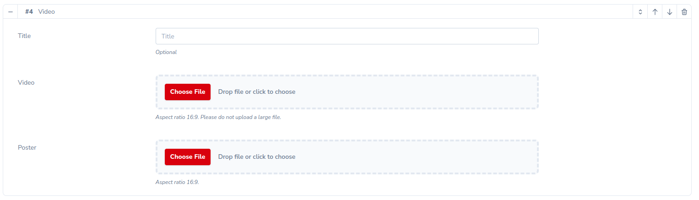
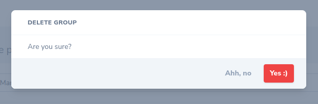

# Laravel Nova Flexible Content


[](https://packagist.org/packages/think.studio/nova-flexible-content)
[](https://packagist.org/packages/think.studio/nova-flexible-content)
[](https://scrutinizer-ci.com/g/dev-think-one/nova-flexible-content/build-status/main)
[](https://scrutinizer-ci.com/g/dev-think-one/nova-flexible-content/?branch=main)
[](https://scrutinizer-ci.com/g/dev-think-one/nova-flexible-content/?branch=main)

**This is fork from great package `whitecube/nova-flexible-content` but reworked without easy possibility to merge
functionality to main package**

An easy & complete Flexible Field for Laravel Nova, perfect for repeated and flexible field groups.


| Nova | Package |
|------|---------|
| V1   | V1 V2   |
| V4   | V3 V4   |

## Installation

```shell
composer require think.studio/nova-flexible-content
# optional publish configs
php artisan vendor:publish --provider="NovaFlexibleContent\ServiceProvider" --tag="config"
```

## Usage

A flexible field allows easy management of repeatable and orderable groups of fields. This package does not have
constraints on which fields you are allowed to use within these groups. That means you can use all Laravel Nova field
types, and also any community-made fields.

### Layouts

A layout represents a group of fields that can be repeated inside the Flexible field. You can add as many different
layouts as you wish. If only one layout is defined the field will behave like a simple Repeater and by adding more
layouts you'll obtain a Flexible Content.

#### Layout definition

```php
namespace App\Nova\Flexible\Layouts;

use Laravel\Nova\Fields\Text;
use Laravel\Nova\Fields\Markdown;
use NovaFlexibleContent\Layouts\Layout;

class VideoLayout extends Layout
{

    // Optionally you limit count of this layout in flexible groups
    // protected int $limit = 3;
    
     protected function linksPreset()
    {
        return Preset::withLayouts([
            LinkLayout::class,
        ]);
    }

    /**
     * Get the fields displayed by the layout.
     */
    public function fields(): array
    {
        return [
            Text::make('Title', 'title')
                ->help('Optional'),
            FileForFlexible::make('Video', 'video')
                           ->prunable()
                           ->acceptedTypes('video/mp4')
                           ->deletable()
                           ->help('Aspect ratio 16:9. Please do not upload a large file.'),
            ImageForFlexible::make('Poster', 'poster')
                            ->prunable()
                            ->rules(['max:' . 1024 * 10])
                            ->deletable()
                            ->help('Aspect ratio 16:9.'),
            // Recursive flexible
            \NovaFlexibleContent\Flexible::make('Links', 'links')
                        ->preset($this->linksPreset())
                        ->layoutsMenuButton('Add link'),
        ];
    }
}
```

Then use this layout

```php
\NovaFlexibleContent\Flexible::make('Content')
    ->useLayout(\App\Nova\Flexible\Layouts\VideoLayout::class)
    ->useLayout(\App\Nova\Flexible\Layouts\FooLayout::class)
    ->useLayout(\App\Nova\Flexible\Layouts\BarLayout::class);
```



#### Customizing display

You can change the display by call methods:

```php
\NovaFlexibleContent\Flexible::make('Content')
    ->fullWidth()
    ->useSearchableLayoutsMenu()
    ->layoutsMenuButton('Add Video')
    ->limit(3)
    ->withGroupRemovingConfirmation('Are you sure?', 'Yes :)', 'Ahh, no');
```



### Value resolver

By default, the field takes advantage of a **JSON column** on your model's table. In some cases, a JSON attribute is
just not the way to go. For example, you could want to store the values in another table (meaning you'll be using the
Flexible Content field instead of a traditional BelongsToMany or HasMany field). No worries, we've got you covered!

#### Resolver definition

Each Resolver MUST implement the `NovaFlexibleContent\Value\Resolver` contract and therefore feature at least
two methods: `set` and `get`.

```php
namespace App\Nova\Flexible\Resolvers;

use NovaFlexibleContent\Layouts\Collections\GroupsCollection;
use NovaFlexibleContent\Layouts\Collections\LayoutsCollection;
use NovaFlexibleContent\Value\Resolver;

class WysiwygPageResolver implements Resolver
{
    public function get(mixed $resource, string $attribute, LayoutsCollection $groups): GroupsCollection
    {
        return new GroupsCollection();
    }

    public function set(mixed $resource, string $attribute, GroupsCollection $groups): string
    {
        return '';
    }
}
```

### Resolve the field

The `get` method used to resolve the field's content. It is responsible to retrieve the content from somewhere and
return a collection of layouts instances (groups). For example, we could want to retrieve the values on a `blocks` table
and transform them into Layout instance:

```php
public function get(mixed $resource, string $attribute, LayoutsCollection $groups): GroupsCollection 
{
    $blocks = $resource->blocks()->orderBy('order')->get();

    return $blocks->map(
        fn($block) => $layouts->find($block->name)
            ?->duplicate($block->id, ['value' => $block->value]);
    )->filter();
}
```

### Fill the field

The `set` method is responsible for saving the Flexible's content. In our example, it should store the data in
a `blocks` table:

```php
public function set(mixed $resource, string $attribute, GroupsCollection $groups): string
{
    if($resource instanceof \Illuminate\Database\Eloquent\Model) {
        $resource::saved(function ($model) use ($groups) {
            // This is a quick & dirty example, syncing the models is probably a better idea.
            $model->blocks()->delete();
            $model->blocks()
                ->createMany($groups->map(function($group, $index) {
                    return [
                        'name' => $group->name(),
                        'value' => $group->toArray(),
                        'order' => $index
                    ];
                }));
        });
    }
    
    return '';
}
```

### Preset

In addition to reusable Layout classes, you can go a step further and create `Preset` classes for your Flexible fields.
These allow you to reuse your whole Flexible field anywhere you want. They also make it easier to make your Flexible
fields dynamic, for example if you want to add Layouts conditionally. And last but not least, they also have the added
benefit of cleaning up your Nova Resource classes, if your Flexible field has a lot of `useLayout` definitions.

#### Preset definition

```php
namespace App\Nova\Flexible\Presets;

use NovaFlexibleContent\Layouts\Preset;

class WysiwygPagePreset extends Preset
{
    /**
     * @var array
     */
    protected array $usedLayouts = [
        \App\Nova\Flexible\Layouts\SimpleWysiwygLayout::class,
        \App\Nova\Flexible\Layouts\FooLayout::class,
    ];
    
    public function handle(\NovaFlexibleContent\Flexible $field)
    {
        parent::handle($field);
        
        $field->layoutsMenuButton('Add new block')
            ->setResolver(\App\Nova\Flexible\Resolvers\WysiwygPageResolver::class)
            ->help('Example help.');
    }
}
```

```php
\NovaFlexibleContent\Flexible::make('Content')
    ->preset(\App\Nova\Flexible\Presets\WysiwygPagePreset::class);
```

### Display flexible content

The field stores its values as a single JSON string, meaning this string needs to be parsed before it can be used in
your application.

```php
namespace App;

use Illuminate\Database\Eloquent\Model;
use NovaFlexibleContent\Concerns\HasFlexible;

class Post extends Model
{
    use HasFlexible;

    // Collect basic `Layout` instances
    public function getCollectedFlexibleContentAttribute()
    {
        return $this->flexible('flexible-content');
    }
    
    // Cast to specified classes
    public function getCastedFlexibleContentAttribute()
    {
        return $this->flexible('flexible-content', [
            'wysiwyg' => \App\Nova\Flexible\Layouts\WysiwygLayout::class,
            'video' => \App\Nova\Flexible\Layouts\VideoLayout::class,
        ]);
    }
}
```

## IDE Helper

Create helper file for IDE your Flexible Layouts in application.

```shell
php artisan nova-flexible-content:ide-helper:layouts
# or
php artisan  nova-flexible-content:ide-helper:layouts --filename custom-file.php
```

## Credits

- [Whitecube](https://whitecube.be/)
- [](https://think.studio/)
