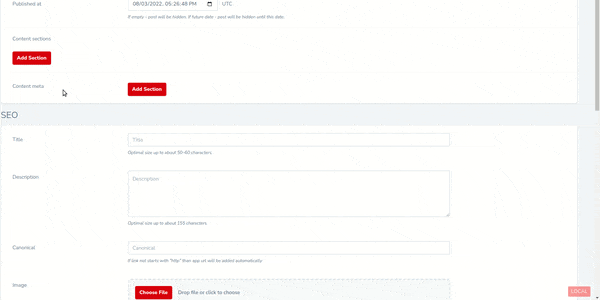
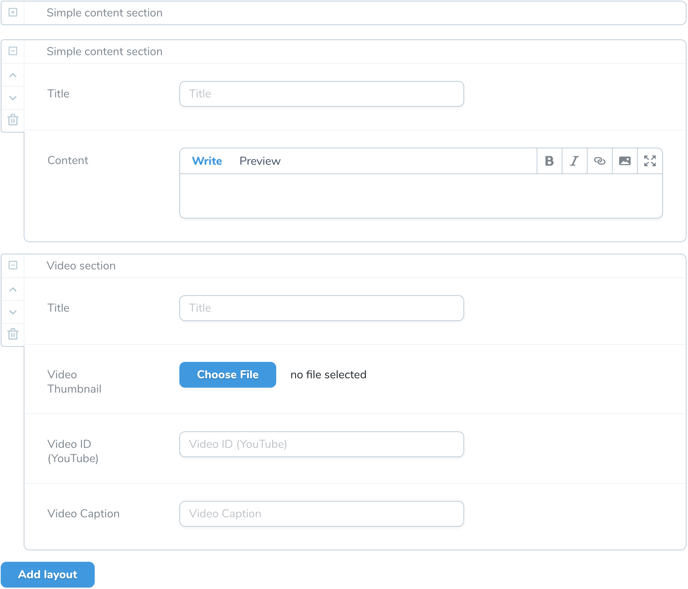
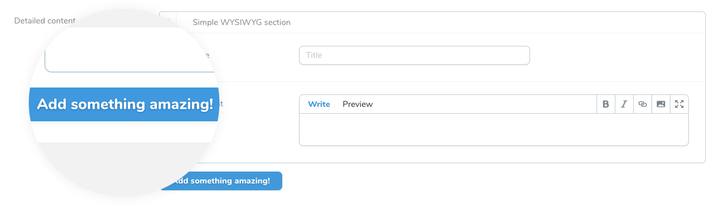
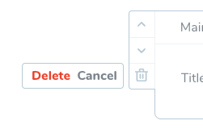

# Laravel Nova Flexible Content

[](https://github.com/yaroslawww/nova-flexible-content/blob/master/LICENSE.md)
[](https://packagist.org/packages/yaroslawww/nova-flexible-content)
[](https://packagist.org/packages/yaroslawww/nova-flexible-content)
[](https://scrutinizer-ci.com/g/yaroslawww/nova-flexible-content/build-status/master)
[](https://scrutinizer-ci.com/g/yaroslawww/nova-flexible-content/?branch=master)
[](https://scrutinizer-ci.com/g/yaroslawww/nova-flexible-content/?branch=master)

**This is fork from great package `whitecube/nova-flexible-content` but reworked without easy possibility to merge
functionality to main package**

An easy & complete Flexible Field for Laravel Nova, perfect for repeated and flexible field groups.



| Nova | Package |
|------|---------|
| V1   | V1 V2   |
| V4   | V3      |

## Installation

```
composer require yaroslawww/nova-flexible-content
# optional publish configs
php artisan vendor:publish --provider="NovaFlexibleContent\ServiceProvider" --tag="config"
```

## Usage

A flexible field allows easy management of repeatable and orderable groups of fields. This package does not have
constraints on which fields you are allowed to use within these groups. That means you can use all Laravel Nova field
types, and also any community-made fields.

### Layouts

A layout represents a group of fields that can be repeated inside the Flexible field. You can add as many different
layouts as you wish. If only one layout is defined the field will behave like a simple Repeater and by adding more
layouts you'll obtain a Flexible Content.

#### Layout definition

Define your layout class manually or using artisan command.

```shell
php artisan flexible:make:layout SimpleWysiwygLayout wysiwyg
```

```php
namespace App\Nova\Flexible\Layouts;

use Laravel\Nova\Fields\Text;
use Laravel\Nova\Fields\Markdown;
use NovaFlexibleContent\Layouts\Layout;

class SimpleWysiwygLayout extends Layout
{
    /**
     * The layout's unique identifier.
     * The `name` parameter used to store the chosen layout in the field's value. 
     * Choose it wisely, you'll probably use it to identify the layouts in your application.
     */
    protected string $name = 'wysiwyg';

    /**
     * The displayed title.
     *
     * @var string
     */
    protected string $title = 'Simple content section';

    /**
     * Get the fields displayed by the layout.
     */
    public function fields(): array
    {
        return [
            Text::make('Title'),
            Markdown::make('Content')
        ];
    }
}
```

Then use this layout

```php
Flexible::make('Content')
    ->useLayout(\App\Nova\Flexible\Layouts\SimpleWysiwygLayout::class)
    ->useLayout(\App\Nova\Flexible\Layouts\FooLayout::class)
    ->useLayout(\App\Nova\Flexible\Layouts\BarLayout::class);
```



#### Customizing the button label

You can change the default "Add layout" button's text like so:

```php
Flexible::make('Content')->button('Add something amazing!');
```



#### Making the field full width

You can make the flexible field full width, taking up all available space on the form, and moving the label above the
field by doing the following:

```php
Flexible::make('Content')->fullWidth()
```

#### Limiting layouts

There two possibility to limit layouts

##### Total layouts instances limit

You can limit how many times the "Add Layout" button will appear by doing the following:

```php
Flexible::make('Content')->limit(2);
```

You can specify any integer, or no integer at all; in that case it will default to 1.

##### Specific layout limit

Specify `$limit` variable to value greater then 0.

```php
namespace App\Nova\Flexible\Layouts;

use NovaFlexibleContent\Layouts\Layout;

class SimpleWysiwygLayout extends Layout
{
    protected int $limit = 3;
    
    // other code
}
```

#### Group removal confirmation

You can choose to display a confirmation prompt after user click on delete group icon:

```php
Flexible::make('Content')->confirmRemove($label = '', $yes = 'Delete', $no = 'Cancel');
```



#### Layout selection menu

You can customize the way your user selects a layout, you can choose between 'flexible-drop-menu' and '
flexible-search-menu' or create your own custom menu component.

```php
// Default, simple list of all layouts
Flexible::make('Content')->menu('flexible-drop-menu');

// searchable select field
Flexible::make('Content')->menu('flexible-search-menu');

// customized searchable select field
Flexible::make('Content')
    ->menu(
        'flexible-search-menu',
        [
            'selectLabel' => 'Press enter to select',
            // the property on the layout entry
            'label' => 'title',
            // 'top', 'bottom', 'auto'
            'openDirection' => 'bottom',
        ]
    );
```

### Value resolver

By default, the field takes advantage of a **JSON column** on your model's table. In some cases, a JSON attribute is
just not the way to go. For example, you could want to store the values in another table (meaning you'll be using the
Flexible Content field instead of a traditional BelongsToMany or HasMany field). No worries, we've got you covered!

#### Resolver definition

Define your Resolver class manually or using artisan command.

```shell
php artisan flexible:make:resolver WysiwygPageResolver
```

Each Resolver MUST implement the `NovaFlexibleContent\Value\ResolverInterface` contract and therefore feature at least
two methods: `set` and `get`.

```php
namespace App\Nova\Flexible\Resolvers;

use NovaFlexibleContent\Contracts\ResolverInterface;
use NovaFlexibleContent\Layouts\GroupsCollection;
use NovaFlexibleContent\Layouts\LayoutsCollection;

class WysiwygPageResolver implements ResolverInterface
{
    public function get(mixed $resource, string $attribute, LayoutsCollection $groups): GroupsCollection
    {
        return new GroupsCollection();
    }

    public function set(mixed $resource, string $attribute, GroupsCollection $groups): string
    {
        return '';
    }
}
```

### Resolve the field

The `get` method used to resolve the field's content. It is responsible to retrieve the content from somewhere and
return a collection of layouts instances (groups). For example, we could want to retrieve the values on a `blocks` table
and transform them into Layout instance:

```php
public function get(mixed $resource, string $attribute, LayoutsCollection $groups): GroupsCollection 
{
    $blocks = $resource->blocks()->orderBy('order')->get();

    return $blocks->map(
        fn($block) => $layouts->find($block->name)
            ?->duplicate($block->id, ['value' => $block->value]);
    )->filter();
}
```

### Fill the field

The `set` method is responsible for saving the Flexible's content. In our example, it should store the data in
a `blocks` table:

```php
public function set(mixed $resource, string $attribute, GroupsCollection $groups): string
{
    if($resource instanceof \Illuminate\Database\Eloquent\Model) {
        $resource::saved(function ($model) use ($groups) {
            // This is a quick & dirty example, syncing the models is probably a better idea.
            $model->blocks()->delete();
            $model->blocks()
                ->createMany($groups->map(function($group, $index) {
                    return [
                        'name' => $group->name(),
                        'value' => $group->toArray(),
                        'order' => $index
                    ];
                }));
        });
    }
    
    return '';
}
```

### Preset

In addition to reusable Layout classes, you can go a step further and create `Preset` classes for your Flexible fields.
These allow you to reuse your whole Flexible field anywhere you want. They also make it easier to make your Flexible
fields dynamic, for example if you want to add Layouts conditionally. And last but not least, they also have the added
benefit of cleaning up your Nova Resource classes, if your Flexible field has a lot of `useLayout` definitions.

#### Preset definition

Define your Preset class manually or using artisan command.

```shell
php artisan flexible:make:preset WysiwygPagePreset
```

```php
namespace App\Nova\Flexible\Presets;

use NovaFlexibleContent\Layouts\Preset;

class WysiwygPagePreset extends Preset
{
    /**
     * @var array
     */
    protected array $usedLayouts = [
        \App\Nova\Flexible\Layouts\SimpleWysiwygLayout::class,
        \App\Nova\Flexible\Layouts\FooLayout::class
    ];
    
    public function handle(Flexible $field)
    {
        parent::handle($field)
            ->button('Add new block')
            ->setResolver(\App\Nova\Flexible\Resolvers\WysiwygPageResolver::class)
            ->help('Example help.');
    }
}
```

```php
Flexible::make('Content')
    ->preset(\App\Nova\Flexible\Presets\WysiwygPagePreset::class);
```

### Display flexible content

The field stores its values as a single JSON string, meaning this string needs to be parsed before it can be used in
your application.

```php
namespace App;

use Illuminate\Database\Eloquent\Model;
use NovaFlexibleContent\Concerns\HasFlexible;

class Post extends Model
{
    use HasFlexible;

    // Collect basic `Layout` instances
    public function getCollectedFlexibleContentAttribute()
    {
        return $this->flexible('flexible-content');
    }
    
    // Cast to specified classes
    public function getCastedFlexibleContentAttribute()
    {
        return $this->flexible('flexible-content', [
            'wysiwyg' => \App\Nova\Flexible\Layouts\WysiwygLayout::class,
            'video' => \App\Nova\Flexible\Layouts\VideoLayout::class,
        ]);
    }
}
```

## Tests

When adding a new feature or fixing a bug, please add corresponding unit tests.

Run PHPUnit by calling `composer test`.

## Credits

- [Whitecube](https://whitecube.be/)
- [](https://think.studio/)
